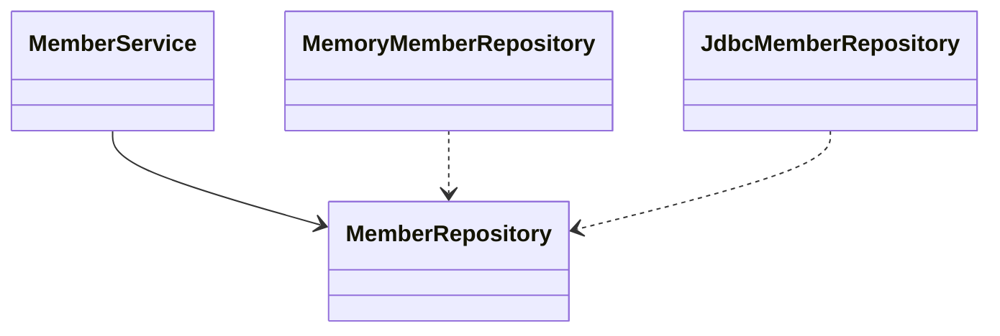

# 6 스프링 DB 접근 기술

# H2 데이터베이스 설치

### H2 데이터베이스의 특징

MYSQL  기반. 교육용이라 가벼움. (용량 6MB)

나 (Windows 10) 기준 설치 방법!

h2database 사이트에서 Windows Installer 내려받고 실행하면 설치 완료.

어플리케이션(윈도우 검색)에서 H2 Console 실행

최초 1회 설정 `jdbc:h2:~/test`

이렇게 하면 home 에 해당하는 경로에 `test.mv.db`파일이 생성되어 있음. 나의 경우에 디폴트 옵션이었는데, 경로는 `C:/사용자/Username` 이었다.

이후 `jdbc:h2:tcp://localhost/~/test` 이렇게 맞춰두고 접속.

이유:  `jdbc:h2:~/test` 로 설정하면 파일에 직접 접근한다. 우리가 연결할 스프링부트 어플리케이션 등, 동시에 여러군데에서 파일에 접근하는 경우 버전 오류가 생길 수 있다. 이것을 막기 위해  `jdbc:h2:tcp://localhost/~/test` 이렇게 접속하면, 직접 파일에 대는 게 아니라 소켓을 통해 접근하게 된다.

### SQL 테이블 생성

H2 Console에 접속해 다음과 같은 쿼리 입력

```sql
drop table if exists member CASCADE;
create table member
(
 id bigint generated by default as identity,
 name varchar(255),
 primary key (id)
)
```

똑같은 내용을 `프로젝트/sql/ddl.sql` 파일에도 생성하였음. Git을 사용하는 경우 이렇게 설정하면 버전 관리가 가능함. 

위 SQL 쿼리에 대한 설명. MEMBER 이름의 테이블 생성, 그 colunm은 id랑 name으로 구성. 이것은 우리가 앞서 스프링부트에서 자바 코드로 짰던 id, name과 같음. (연동시켜야 하니까 당연!)

`generated ~` 부분의 의미. 이후 SQL 쿼리에서 값을 insert 하게 되는데, 이 부분이 있으면 id를 채우지 않고 name만 담아서 insert 하면 id는 자동으로 채워짐. (1, 2, 3 ... 이렇게 채워진다.)

SQL에서는 문자열에 쌍따옴표가 아니라 홑따옴표를 쓰는 모양이다. insert 할 때 쌍따옴표를 넣으면 오류가 났다.

## 순수 JDBC

순수 JDBC로 데이터베이스를 연결하는 방식은 상당히 예전에 쓰이던 방법이다. 참고 차원에서 알아보기만 하자.

```java
...
public class JdbcMemberRepository implements MemberRepository {
	private final DataSource dataSource;
	public JdbcMemberRepository(DataSource dataSource) {
		this.dataSource = dataSource;
	}
...
}

// 코드 복잡, 이 클래스 외에 설정할 것 다수.
```

앞서 MemoryMemberRepository를 사용하기 전에, MemberRepository라는 인터페이스를 정의하고 그 인터페이스를 구현하는 형태로 개발하였다.

JDBC 방식도 마찬가지로, 인터페이스의 새로운 구현체를 생성한다. 이 방식의 장점을 아래에서 다시 설명한다.

데이터를 DB에 저장하므로 스프링 서버를 다시 실행해도 데이터가 안전하게 저장된다.




> 그래프가 원래 이렇게 안 생겼는데 Mermaid에서 위치 지정까지는 안 되는 것 같다. 그래프 그리는 건 보류 하자.
>
> [Mermaid-js/ClassDiagram](https://mermaid-js.github.io/mermaid/#/./classDiagram)

* 개방 폐쇄 원칙 (OCP)

  * 확장에는 열려있고, 수정, 변경에는 닫혀있다.
  * 인터페이스의 경우 구현체를 추가해 확장할 수 있다. 구현체를 추가하는데에 있어 기존 구현체들이나 인터페이스의 수정이 불필요하다.
  * 객체지향의 매. 력. 

* 스프링의 DI

  * 기존 코드에 손대지 않고, 설정만으로 구현 클래스를 변경할 수 있다.

  ```java
  @Bean
     public MemberRepository memberRepository() {
    //   return new MemoryMemberRepository();
         return new JdbcMemberRepository(dataSource);
     }
     
  ```


## 스프링 통합 테스트

내. 일. 할. 거. 야

## 스프링 JdbcTemplate

## JPA

## 스프링 데이터 JPA